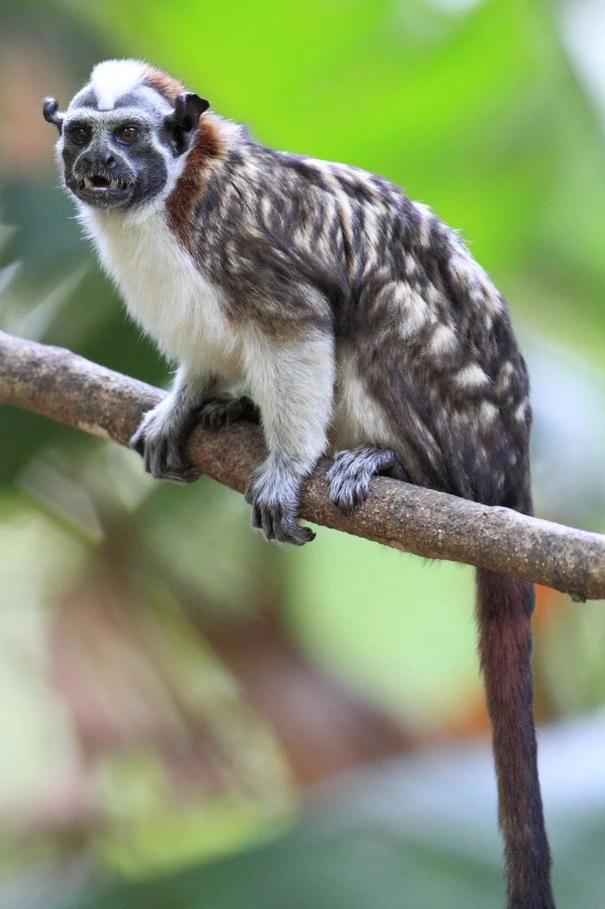

--- 
title: "Reproducible Data Science - Final semester project"
author: "Brynn Harshbarger"
date: "`r Sys.Date()`"
site: bookdown::bookdown_site
documentclass: book
bibliography: [book.bib, packages.bib]
# url: your book url like https://bookdown.org/yihui/bookdown
# cover-image: path to the social sharing image like images/cover.jpg
description: |
  This is the webpage that shows my Reproducible Data Science project. 
link-citations: yes
github-repo: rstudio/bookdown-demo
---

# Project details 

This is the final semester project I am working on for Reproducible Data Science
2023. In this project, I created a SQL database using data on Geoffroy's tamarins
that was shared with me by Dr. Samuel Díaz-Muñoz. Next, I calculated and plotted
home ranges of each tamarin group using the sp package. 

I will not end up working with this data for my dissertation (I am very happy to 
say I've managed to get my lemur seed dispersal project off the ground!), but it
was still fun to play around with. I would like to eventually learn how to use 
the amt package to create home ranges. 

```{r eval=FALSE, echo = FALSE}
bookdown::serve_book()
```


```{r include=FALSE}
# automatically create a bib database for R packages
knitr::write_bib(c(
  .packages(), 'bookdown', 'knitr', 'rmarkdown'
), 'packages.bib')
```

```{r image, fig.align='center', out.width='100%', echo = FALSE}

```

